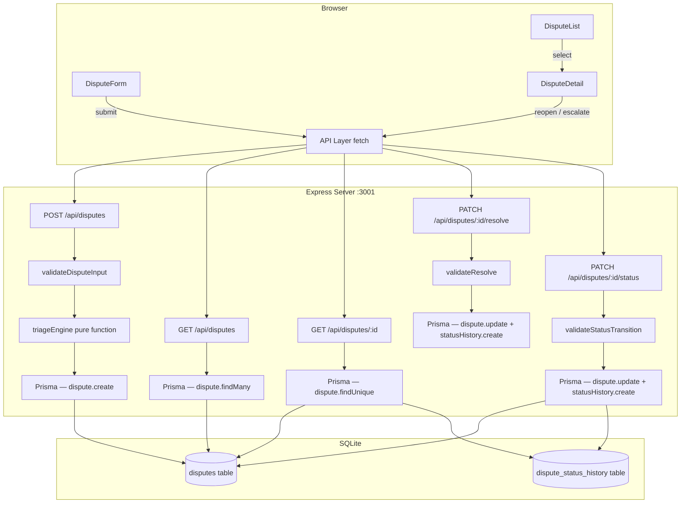

# Design Document — Payment Dispute Triage

## Overview

The Payment Dispute Triage feature is an internal operations tool that lets banking operations staff capture a customer payment dispute, receive an instant deterministic recommendation, and track the full lifecycle of each case. The system is self-contained: a React frontend, an Express backend, SQLite via Prisma, and a pure-function rules engine — no external integrations.

The core journey is:
1. Operations user fills in the Dispute Form.
2. The backend validates inputs, runs the triage engine, and persists the dispute with its recommended action.
3. The frontend displays the recommendation immediately with a clear urgency indicator.
4. The user can browse the dispute list, view details, and reopen or escalate resolved cases.

---

## Architecture



Data flows in a single direction: the browser issues a `fetch` to the Vite dev proxy (`/api/*` → `localhost:3001`). The Express route handler validates, delegates to the triage engine (a pure function with no I/O), then writes to SQLite via Prisma. Responses carry the full resource representation so the frontend can update local state without re-fetching.

---

## Components and Interfaces

### Backend modules

| File | Responsibility |
|---|---|
| `server/src/routes/disputes.ts` | Express router — one file per resource, named export `disputesRouter` |
| `server/src/triage-engine.ts` | Pure function `triageDispute(input): RecommendedAction` — no I/O, fully deterministic |
| `server/src/validation.ts` | Input validation helpers returning `ValidationError[]` |
| `server/src/db.ts` | Singleton `PrismaClient` export |
| `server/src/middleware/errorHandler.ts` | Centralised error middleware (existing) |

### Frontend components

| File | Responsibility |
|---|---|
| `client/src/components/DisputeForm.tsx` | Controlled form for capturing a new dispute; shows TriageResult on success |
| `client/src/components/DisputeList.tsx` | Paginated table of past disputes; row click navigates to DisputeDetail |
| `client/src/components/DisputeDetail.tsx` | Full dispute view including status history; Reopen / Escalate actions for resolved disputes |
| `client/src/components/TriageResult.tsx` | Recommendation display with urgency indicator; reusable in both DisputeForm and DisputeDetail |
| `client/src/components/StatusHistory.tsx` | Renders the ordered list of status changes for a dispute |
| `client/src/App.tsx` | Root — tab or route switching between DisputeForm and DisputeList |

### Triage engine interface

```ts
// server/src/triage-engine.ts

export type PaymentType =
  | 'card_transaction'
  | 'bank_transfer'
  | 'direct_debit'
  | 'standing_order';

export type IssueCategory =
  | 'duplicate_charge'
  | 'failed_transfer'
  | 'missing_payment'
  | 'unauthorized_transaction'
  | 'incorrect_amount';

export type TransactionStatus = 'pending' | 'completed' | 'failed' | 'reversed';

export type RecommendedAction =
  | 'auto_refund'
  | 'manual_review'
  | 'escalate_to_fraud'
  | 'contact_customer'
  | 'reject_dispute';

export interface TriageInput {
  paymentType: PaymentType;
  issueCategory: IssueCategory;
  transactionStatus: TransactionStatus;
  amount: number;          // positive, up to 2 decimal places
  disputeAge: number;      // calendar days from transaction date to submission date
}

export function triageDispute(input: TriageInput): RecommendedAction;
```

`triageDispute` is a pure function — it takes a `TriageInput` and returns a `RecommendedAction`. It has no side effects and does not interact with Prisma or the network. This makes it trivially testable and deterministic.

---

## Data Models

### Prisma schema additions

```prisma
// server/prisma/schema.prisma  (replaces the placeholder User model)

enum PaymentType {
  card_transaction
  bank_transfer
  direct_debit
  standing_order
}

enum IssueCategory {
  duplicate_charge
  failed_transfer
  missing_payment
  unauthorized_transaction
  incorrect_amount
}

enum TransactionStatus {
  pending
  completed
  failed
  reversed
}

enum RecommendedAction {
  auto_refund
  manual_review
  escalate_to_fraud
  contact_customer
  reject_dispute
}

enum DisputeStatus {
  open
  resolved
  escalated
  reopened
}

model Dispute {
  id                 String               @id @default(cuid())
  disputeRef         String               @unique
  customerName       String               @db.VarChar(200)
  transactionRef     String               @db.VarChar(50)
  paymentType        PaymentType
  issueCategory      IssueCategory
  transactionStatus  TransactionStatus
  amount             Float
  transactionDate    DateTime
  description        String?              @db.VarChar(2000)
  recommendedAction  RecommendedAction
  disputeStatus      DisputeStatus        @default(open)
  createdAt          DateTime             @default(now())
  updatedAt          DateTime             @updatedAt
  statusHistory      DisputeStatusHistory[]
}

model DisputeStatusHistory {
  id         String        @id @default(cuid())
  disputeId  String
  status     DisputeStatus
  reason     String
  changedAt  DateTime      @default(now())
  dispute    Dispute       @relation(fields: [disputeId], references: [id])
}
```

**Design decisions:**

- `disputeRef` is a server-generated human-readable reference in the format `DSP-YYYYMMDD-XXXX`, where `XXXX` is a random 4-character string drawn from an unambiguous alphabet (no `0`/`O` or `1`/`I` confusion). It has a unique constraint. Generated by `server/src/dispute-ref.ts`; callers should retry on collision.
- `amount` is stored as `Float`. SQLite has no `DECIMAL` type; for a prototype with mock data this is acceptable. A production system would use an integer cents representation.
- `transactionDate` is stored as `DateTime`; the client sends an ISO 8601 date string, the backend parses it with `new Date()`.
- `description` is optional (`String?`) — the form allows submission without a description.
- `DisputeStatusHistory` is a separate table rather than a JSON column so it can be queried, ordered, and extended without schema migration.
- `cuid()` is used for IDs — short, collision-resistant, URL-safe.
- **Enums → String fields (SQLite limitation):** The schema above shows Prisma `enum` types for `PaymentType`, `IssueCategory`, etc. The actual `schema.prisma` uses `String` fields instead. SQLite does not support native enum types in Prisma, so all enum columns are stored as plain strings. Validation is enforced at the application layer in `server/src/validation.ts`, not at the database level. This is an intentional trade-off for the SQLite prototype — a production PostgreSQL deployment could use the enum definitions shown above without any other changes.

---

## API Contract

All responses use camelCase JSON. Timestamps are ISO 8601 UTC. Errors follow the standard envelope.

### POST /api/disputes

Create a new dispute and run triage.

**Request body:**
```json
{
  "customerName": "Jane Smith",
  "transactionRef": "TXN-20240601-001",
  "paymentType": "card_transaction",
  "issueCategory": "unauthorized_transaction",
  "transactionStatus": "completed",
  "amount": 750.00,
  "transactionDate": "2026-05-15T00:00:00.000Z",
  "description": "Customer did not authorise this transaction."
}
```

**201 Created — response body:**
```json
{
  "id": "clx1abc123",
  "disputeRef": "DSP-20260622-K7M2",
  "customerName": "Jane Smith",
  "transactionRef": "TXN-20240601-001",
  "paymentType": "card_transaction",
  "issueCategory": "unauthorized_transaction",
  "transactionStatus": "completed",
  "amount": 750.00,
  "transactionDate": "2026-05-15T00:00:00.000Z",
  "description": "Customer did not authorise this transaction.",
  "recommendedAction": "escalate_to_fraud",
  "disputeStatus": "open",
  "createdAt": "2026-06-22T10:30:00.000Z",
  "updatedAt": "2026-06-22T10:30:00.000Z",
  "statusHistory": []
}
```

**400 Bad Request — validation failure:**
```json
{
  "error": {
    "code": "VALIDATION_ERROR",
    "message": "Request validation failed",
    "details": [
      { "field": "paymentType", "message": "Must be one of: card_transaction, bank_transfer, direct_debit, standing_order" },
      { "field": "amount", "message": "Must be between 0.01 and 999999999.99" }
    ]
  }
}
```

**409 Conflict — duplicate transaction reference:**
```json
{
  "error": {
    "code": "DUPLICATE_TRANSACTION_REF",
    "message": "A dispute for transaction reference 'TXN-20240601-001' already exists (dispute id: clx1abc123)"
  }
}
```

---

### GET /api/disputes

List disputes ordered by `createdAt` descending, paginated.

**Query params:** `page` (default 1), `pageSize` (default 50, max 100)

**200 OK:**
```json
{
  "data": [
    {
      "id": "clx1abc123",
      "customerName": "Jane Smith",
      "paymentType": "card_transaction",
      "issueCategory": "unauthorized_transaction",
      "recommendedAction": "escalate_to_fraud",
      "disputeStatus": "open",
      "amount": 750.00,
      "createdAt": "2026-06-22T10:30:00.000Z"
    }
  ],
  "pagination": {
    "page": 1,
    "pageSize": 50,
    "total": 1
  }
}
```

---

### GET /api/disputes/:id

Retrieve a single dispute with full details and status history.

**200 OK:** Full dispute object (same shape as POST 201 response) with `statusHistory` array populated.

```json
{
  "id": "clx1abc123",
  "disputeRef": "DSP-20260622-K7M2",
  "customerName": "Jane Smith",
  "transactionRef": "TXN-20240601-001",
  "paymentType": "card_transaction",
  "issueCategory": "unauthorized_transaction",
  "transactionStatus": "completed",
  "amount": 750.00,
  "transactionDate": "2026-05-15T00:00:00.000Z",
  "description": "Customer did not authorise this transaction.",
  "recommendedAction": "escalate_to_fraud",
  "disputeStatus": "escalated",
  "createdAt": "2026-06-22T10:30:00.000Z",
  "updatedAt": "2026-06-22T11:00:00.000Z",
  "statusHistory": [
    {
      "id": "clx2def456",
      "status": "escalated",
      "reason": "Confirmed fraud by customer callback.",
      "changedAt": "2026-06-22T11:00:00.000Z"
    }
  ]
}
```

**404 Not Found:**
```json
{ "error": { "code": "DISPUTE_NOT_FOUND", "message": "No dispute found with id clx1abc123" } }
```

---

### PATCH /api/disputes/:id/resolve

Mark a dispute as resolved. Primarily used by E2E tests to seed a resolved dispute, but also a valid operations action.

**Request body:**
```json
{
  "reason": "Issue confirmed resolved by customer callback."
}
```

`reason` is required (non-empty string).

**200 OK:** Full dispute object with `disputeStatus` set to `"resolved"` and a new entry appended to `statusHistory`.

**400 Bad Request** — missing or empty `reason`.

**404 Not Found** — dispute does not exist.

---

### PATCH /api/disputes/:id/status

Reopen or escalate a resolved dispute.

**Request body:**
```json
{
  "action": "reopen",
  "reason": "Customer provided new evidence."
}
```

`action` must be `"reopen"` or `"escalate"`. `reason` is required (non-empty string).

The dispute must currently have `disputeStatus === "resolved"`. Any other status returns 422.

**200 OK:** Full dispute object with updated `disputeStatus`, updated `recommendedAction` (only changes on escalate → `escalate_to_fraud`), and new entry appended to `statusHistory`.

**400 Bad Request** — missing or invalid `action` / `reason`.

**404 Not Found** — dispute does not exist.

**422 Unprocessable Entity:**
```json
{ "error": { "code": "INVALID_STATUS_TRANSITION", "message": "Dispute must be in 'resolved' state to reopen or escalate. Current status: open" } }
```

---

## Triage Rules Engine Design

### Design rationale

The engine is implemented as a **single pure function** (`triageDispute`) in `server/src/triage-engine.ts`. It accepts a `TriageInput` and returns a `RecommendedAction`. The function has no imports from Prisma, Express, or any I/O layer — it is completely isolated from infrastructure.

This design enables:
- **Full unit testability** without any mocks or setup.
- **Property-based testing** with simple random input generation.
- **Determinism** — the same inputs always produce the same output.
- **Auditability** — the rules are explicit, ordered, and readable.

### Rule evaluation order

Rules are evaluated in declaration order. The first rule whose conditions match is applied; subsequent rules are not evaluated. This matches Requirement 2.1 exactly.

```
Rule 1: issueCategory === 'unauthorized_transaction' AND amount > 500
         → escalate_to_fraud

Rule 2: issueCategory === 'unauthorized_transaction' AND amount <= 500
         → manual_review

Rule 3: issueCategory === 'duplicate_charge' AND transactionStatus === 'completed'
         → auto_refund

Rule 4: issueCategory === 'failed_transfer' AND transactionStatus === 'failed'
         → contact_customer

Rule 5: issueCategory === 'missing_payment' AND disputeAge > 30
         → escalate_to_fraud

Rule 6: issueCategory === 'missing_payment' AND disputeAge <= 30
         → manual_review

Rule 7: issueCategory === 'incorrect_amount'
         → manual_review

Default: (no rule matched)
         → manual_review
```

### Implementation pattern

```ts
export function triageDispute(input: TriageInput): RecommendedAction {
  const { issueCategory, transactionStatus, amount, disputeAge } = input;

  // Rule 1
  if (issueCategory === 'unauthorized_transaction' && amount > 500) {
    return 'escalate_to_fraud';
  }
  // Rule 2
  if (issueCategory === 'unauthorized_transaction' && amount <= 500) {
    return 'manual_review';
  }
  // Rule 3
  if (issueCategory === 'duplicate_charge' && transactionStatus === 'completed') {
    return 'auto_refund';
  }
  // Rule 4
  if (issueCategory === 'failed_transfer' && transactionStatus === 'failed') {
    return 'contact_customer';
  }
  // Rule 5
  if (issueCategory === 'missing_payment' && disputeAge > 30) {
    return 'escalate_to_fraud';
  }
  // Rule 6
  if (issueCategory === 'missing_payment' && disputeAge <= 30) {
    return 'manual_review';
  }
  // Rule 7
  if (issueCategory === 'incorrect_amount') {
    return 'manual_review';
  }
  // Default
  return 'manual_review';
}
```

`disputeAge` is calculated in the route handler before calling `triageDispute`:

```ts
const disputeAge = Math.floor(
  (Date.now() - new Date(req.body.transactionDate).getTime()) / (1000 * 60 * 60 * 24)
);
```

This keeps the engine free of `Date` coupling and makes property tests simpler (pass any integer age).

### Dispute age boundary

Requirement 2.6 uses "exceeds 30 days" (strictly greater than 30). Requirement 2.7 uses "30 days or less" (≤ 30). The boundary condition at exactly 30 days goes to `manual_review`. This is an important edge case covered by the property tests.

---

## Frontend Component Breakdown

### State and data flow

```
App
├── DisputeForm          ← manages: formState, submitting, triageResult, error
│   └── TriageResult     ← pure display: receives RecommendedAction + urgency
│
└── DisputeList          ← manages: disputes[], loading, error, page
    └── DisputeDetail    ← manages: dispute (full), submitting, confirmState
        ├── TriageResult
        └── StatusHistory
```

There is no global state store. Each component fetches and manages its own data via `useState` + `useEffect`. The only shared state is which view is active (controlled in `App.tsx`).

### DisputeForm

- Controlled form using one `useState` object for all field values.
- On submit: validates client-side (matches server rules), shows inline errors without clearing fields, then POSTs to `/api/disputes`.
- On success: renders `TriageResult` with the returned `recommendedAction`; shows dispute reference (`disputeRef`) in a success banner.
- On API error: shows the error message from the response envelope.
- All inputs have `data-testid` attributes matching the field name (e.g., `data-testid="customer-name"`, `data-testid="submit-dispute"`).
- Character count for the description field is computed as `2000 - description.length` and rendered next to the textarea.

### DisputeList

- Fetches `GET /api/disputes?page=1&pageSize=50` on mount.
- Renders a table with columns: Customer Name, Payment Type, Issue Category, Recommended Action, Status, Created At.
- Each row has `data-testid="dispute-row-{id}"` for E2E tests.
- Pagination controls appear when `total > pageSize`.
- Empty state and error state each have a `data-testid` for testing.

### DisputeDetail

- Receives the dispute `id` as a prop; fetches the full record on mount.
- Renders all fields including description and `statusHistory`.
- Conditionally renders `TriageResult` and the `StatusHistory` list.
- For resolved disputes: renders "Reopen" and "Escalate" buttons (`data-testid="reopen-btn"`, `data-testid="escalate-btn"`).
- For open, reopened, or escalated disputes: renders a "Mark as Resolved" button (`data-testid="resolve-btn"`) that PATCHes `/api/disputes/:id/resolve`.
- Clicking any action button opens an inline confirmation panel with a required reason textarea and a confirm button.
- On confirm: PATCHes the appropriate endpoint (`/api/disputes/:id/status` for reopen/escalate, `/api/disputes/:id/resolve` for resolve), then refreshes the dispute record.
- For resolved disputes: the "Mark as Resolved" button is not rendered.

### TriageResult

Pure display component.

```ts
interface TriageResultProps {
  action: RecommendedAction;
}
```

Renders a labelled result card. The urgency variant is determined by whether `action === 'escalate_to_fraud'`:

| Action | Label | Variant |
|---|---|---|
| `escalate_to_fraud` | Escalate to Fraud Team | high-urgency (red) |
| `auto_refund` | Auto Refund | standard (green) |
| `manual_review` | Manual Review | standard (blue) |
| `contact_customer` | Contact Customer | standard (amber) |
| `reject_dispute` | Reject Dispute | standard (grey) |

Uses `data-testid="triage-result"`, `data-testid="triage-urgency-high"` / `data-testid="triage-urgency-standard"`.

### StatusHistory

Receives `DisputeStatusHistory[]` and renders a chronological list. Each entry shows: status badge, reason, and formatted timestamp. `data-testid="status-history-list"`.

---

## Correctness Properties

*A property is a characteristic or behavior that should hold true across all valid executions of a system — essentially, a formal statement about what the system should do. Properties serve as the bridge between human-readable specifications and machine-verifiable correctness guarantees.*

The triage engine is a pure function, making it an ideal candidate for property-based testing. The persistence and validation layers also have universal properties that hold across all valid inputs.

PBT uses **fast-check** (the standard PBT library for TypeScript). Each test runs a minimum of 100 iterations.

Tag format in tests: `// Feature: payment-dispute-triage, Property N: <property text>`

---

### Property 1: Dispute creation round-trip

*For any* valid dispute input, creating a dispute via `POST /api/disputes` shall return a unique ID, and retrieving that dispute via `GET /api/disputes/:id` shall return all submitted fields unchanged, along with the calculated `recommendedAction` and a `createdAt` timestamp.

**Validates: Requirements 1.2, 6.1, 6.2**

---

### Property 2: Rule priority — first matching rule wins

*For any* valid `TriageInput`, the result of `triageDispute` is equal to the action from the first rule in the ordered rule list whose conditions are satisfied by that input. No later rule can change the outcome once an earlier rule has matched.

**Validates: Requirements 2.1**

---

### Property 3: Unauthorized transaction threshold

*For any* dispute with `issueCategory === 'unauthorized_transaction'`, if `amount > 500` then `triageDispute` returns `escalate_to_fraud`; if `amount <= 500` then `triageDispute` returns `manual_review`. This holds regardless of `paymentType`, `transactionStatus`, and `disputeAge`.

**Validates: Requirements 2.2, 2.3**

---

### Property 4: Missing payment age threshold

*For any* dispute with `issueCategory === 'missing_payment'`, if `disputeAge > 30` then `triageDispute` returns `escalate_to_fraud`; if `disputeAge <= 30` then `triageDispute` returns `manual_review`. This holds regardless of `paymentType`, `transactionStatus`, and `amount`.

**Validates: Requirements 2.6, 2.7**

---

### Property 5: Specific rule branches produce correct actions

*For any* dispute where `issueCategory === 'duplicate_charge'` and `transactionStatus === 'completed'`, `triageDispute` returns `auto_refund`. *For any* dispute where `issueCategory === 'failed_transfer'` and `transactionStatus === 'failed'`, `triageDispute` returns `contact_customer`. *For any* dispute where `issueCategory === 'incorrect_amount'`, `triageDispute` returns `manual_review`.

**Validates: Requirements 2.4, 2.5, 2.8**

---

### Property 6: Default fallback to manual_review

*For any* valid `TriageInput` that does not satisfy the conditions of rules 1–7 (e.g., `duplicate_charge` with `transactionStatus !== 'completed'`, or `failed_transfer` with `transactionStatus !== 'failed'`), `triageDispute` returns `manual_review`.

**Validates: Requirements 2.9**

---

### Property 7: Validation reports all invalid fields

*For any* request body containing one or more fields with invalid values (invalid enum, out-of-range amount, missing required field), the API returns a `400 VALIDATION_ERROR` response whose `details` array contains exactly one entry per invalid field, and each entry identifies the correct field name. No valid fields are reported as invalid.

**Validates: Requirements 5.1, 5.2, 5.3, 5.4, 5.5, 5.6, 2.10**

---

### Property 8: Amount boundary

*For any* numeric value `v` where `0.01 <= v <= 999999999.99`, the amount field is accepted as valid. *For any* value `v <= 0` or `v > 999999999.99`, the amount field is rejected with a `VALIDATION_ERROR` citing the `amount` field and the acceptable range.

**Validates: Requirements 1.4, 5.4**

---

### Property 9: Dispute list ordered by creation date descending

*For any* set of N disputes created in any order, `GET /api/disputes` returns them such that `data[i].createdAt >= data[i+1].createdAt` for all adjacent pairs across all pages.

**Validates: Requirements 4.1**

---

### Property 10: Status transition and history round-trip

*For any* resolved dispute and *any* non-empty reason string, applying a `reopen` or `escalate` action via `PATCH /api/disputes/:id/status` shall append a new entry to `statusHistory` containing the new status, the submitted reason, and a `changedAt` timestamp; and retrieving the dispute shall reflect the updated `disputeStatus` and the complete history in chronological order.

**Validates: Requirements 7.2, 7.3, 7.4, 7.7**

---

### Property 11: Action button visibility conditional on dispute status

*For any* dispute with `disputeStatus === 'resolved'`, the `DisputeDetail` component renders both the "Reopen" and "Escalate" action buttons. *For any* dispute with `disputeStatus` in `['open', 'escalated', 'reopened']`, neither button is rendered. The "Mark as Resolved" button renders when `disputeStatus` is `open`, `reopened`, or `escalated`, and is not rendered when `disputeStatus === 'resolved'`.

**Validates: Requirements 7.1, 7.6**

---

### Property 12: Urgency indicator maps correctly to recommended action

*For any* `RecommendedAction` value, the `TriageResult` component renders the high-urgency indicator if and only if the action is `escalate_to_fraud`; for all other action values it renders the standard-priority indicator and never the high-urgency indicator.

**Validates: Requirements 3.3, 3.4**

---

## Error Handling

| Scenario | HTTP status | Error code | Notes |
|---|---|---|---|
| Required field missing | 400 | `VALIDATION_ERROR` | `details` array lists all missing fields |
| Invalid enum value | 400 | `VALIDATION_ERROR` | `details` includes valid values |
| Amount out of range | 400 | `VALIDATION_ERROR` | `details` states acceptable range |
| Transaction date in the future | 400 | `VALIDATION_ERROR` | `details` identifies `transactionDate` |
| Duplicate transaction reference | 409 | `DUPLICATE_TRANSACTION_REF` | Only one dispute per `transactionRef` is allowed |
| Dispute not found | 404 | `DISPUTE_NOT_FOUND` | — |
| Status transition on non-resolved dispute | 422 | `INVALID_STATUS_TRANSITION` | Current status included in message |
| Invalid action value in PATCH | 400 | `VALIDATION_ERROR` | — |
| Empty reason in PATCH | 400 | `VALIDATION_ERROR` | — |
| Dispute not found on resolve | 404 | `DISPUTE_NOT_FOUND` | — |
| Prisma write failure | 500 | `INTERNAL_ERROR` | Do not confirm creation; log error |
| Unexpected server error | 500 | `INTERNAL_ERROR` | Caught by `errorHandler` middleware |

All errors are thrown from route handlers with `status` and `code` properties and caught by the existing centralised `errorHandler` middleware. No `res.json()` calls for errors in route handlers.

Client-side error states:
- **Triage submission failure**: Display the `error.message` from the response envelope inline on the form.
- **List load failure**: Show a full-width error banner with a Retry button (`data-testid="retry-list"`).
- **Detail load failure**: Show an error message with a Retry button in the detail panel.
- **Timeout (>10 s)**: Use `AbortController` with a 10-second timeout on the submit fetch; show an error banner with a Retry button on abort.

---

## Testing Strategy

### Backend unit tests (`server/tests/`)

**Triage engine tests** (`triage-engine.test.ts`):
- Example-based tests for each named rule: one test per rule branch with a concrete input that exactly satisfies the rule conditions.
- One test for the default fallback with an input that matches no rule.
- Boundary tests: amount exactly at 500, amount exactly at 500.01; disputeAge exactly at 30, exactly at 31.
- Property-based tests (fast-check) covering Properties 2–6 above, with a minimum of 100 iterations each.

**Validation tests** (`validation.test.ts`):
- Property-based tests covering Properties 7 and 8.
- Example-based tests for multi-error responses (one missing, one invalid enum, one out-of-range in the same request).

**Disputes route tests** (`disputes.test.ts`):
- Property-based test for Property 1 (creation round-trip) using a mock Prisma client.
- Property-based test for Property 9 (ordering) by seeding mock disputes with known timestamps.
- Property-based test for Property 10 (status history round-trip) with a mock Prisma client.
- Example-based tests for 404 and 422 responses.

### Frontend component tests (`client/tests/`)

- `DisputeForm.test.tsx`: Property-based test for Property 12 (urgency indicator) using fast-check to generate all `RecommendedAction` values. Property-based test for Property 11 (action button visibility) with generated dispute status values. Example-based tests for validation error display and success confirmation.
- `DisputeList.test.tsx`: Example-based tests for empty state, error state, and pagination controls.
- `DisputeDetail.test.tsx`: Property-based test for Property 11. Example-based tests for field display and confirmation flow.
- `TriageResult.test.tsx`: Property-based test for Property 12.

### End-to-end tests (`client/e2e/`)

- `dispute-form.spec.ts`: Full happy-path journey — fill form, submit, see recommendation.
- `dispute-list.spec.ts`: Create a dispute, navigate to list, verify it appears.
- `dispute-detail.spec.ts`: Open a resolved dispute, click Reopen, enter reason, confirm, verify status change.

### Property test configuration

```ts
// vitest.config.ts — no changes needed; fast-check runs synchronously inside Vitest
// Install: npm install --save-dev fast-check --workspace=server
//          npm install --save-dev fast-check --workspace=client

// Minimum iterations per property test:
fc.assert(fc.property(...), { numRuns: 100 });
```

Each property test is annotated with a comment referencing the design property:
```ts
// Feature: payment-dispute-triage, Property 3: Unauthorized transaction threshold
```
